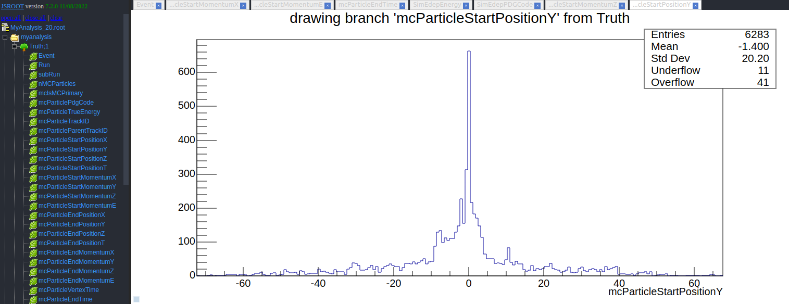

# MyTruthAnalysis

Analyzer that dumps:

* G4 stage particles information (Truth)
* Energy depositions

The .fcl file is configured to dump the information in a ROOT file.

## LArSoft preparation

```bash
source /cvmfs/dune.opensciencegrid.org/products/dune/setup_dune.sh
source localProducts_larsoft*/setup

setup larsoft v09_63_00  -q e20:prof  
mrbslp
setup

mrbsetenv
```

## How to use

```bash
lar -c run_mytruthanalysis.fcl -s <input_file> -n <number_of_events>
```

## Output example
ROOT file with the analyzed Trees:


## TODO

* Create trees/branches only if they are going to be filled

